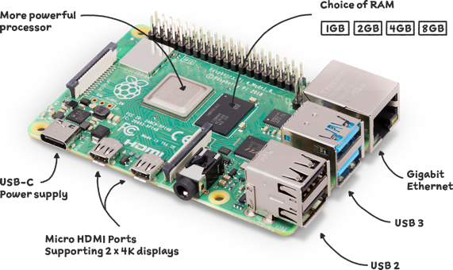
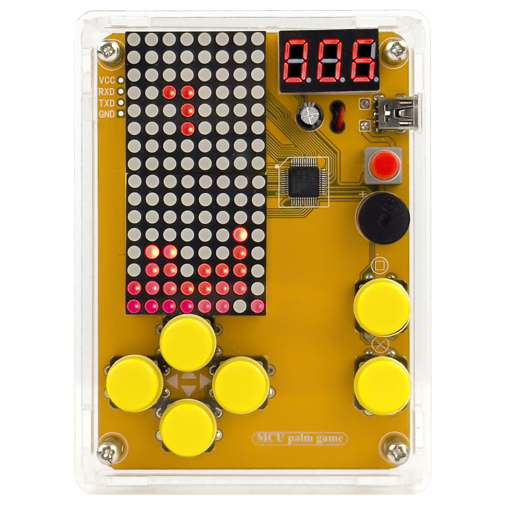

# Custom Object Detection and Sorting 
My project provides an effortless solution to deciding whether trash should thrown away or recycled. Through the use of AI scanning a Raspberry Pi figures out exactly what kind of trash you are holding, and opens the corresponding wastebasket. 


<!---Replace this text with a brief description (2-3 sentences) of your project. This description should draw the reader in and make them interested in what you've built. You can include what the biggest challenges, takeaways, and triumphs from completing the project were. As you complete your portfolio, remember your audience is less familiar than you are with all that your project entails!-->

<!---You should comment out all portions of your portfolio that you have not completed yet, as well as any instructions:-->

| **Engineer** | **School** | **Area of Interest** | **Grade** |
|:--:|:--:|:--:|:--:|
| Aaron H | VCHS | Mechanical Engineering | Incoming Sophomore

<!---# !!!!edits needed
**Replace the BlueStamp logo below with an image of yourself and your completed project. Follow the guide [here](https://tomcam.github.io/least-github-pages/adding-images-github-pages-site.html) if you need help.**-->

<!---->


<!---# Final Milestone

# !!!!edits needed
**Don't forget to replace the text below with the embedding for your milestone video. Go to Youtube, click Share -> Embed, and copy and paste the code to replace what's below.**

<iframe width="560" height="315" src="https://www.youtube.com/embed/WIRK_pGdIdA?si=Jmkf0DeEBADPxmr3" title="YouTube video player" frameborder="0" allow="accelerometer; autoplay; clipboard-write; encrypted-media; gyroscope; picture-in-picture; web-share" referrerpolicy="strict-origin-when-cross-origin" allowfullscreen></iframe>

For your final milestone, explain the outcome of your project. Key details to include are:
- What you've accomplished since your previous milestone
- What your biggest challenges and triumphs were at BSE
- A summary of key topics you learned about
- What you hope to learn in the future after everything you've learned at BSE

-->

# Second Milestone

**Don't forget to replace the text below with the embedding for your milestone video. Go to Youtube, click Share -> Embed, and copy and paste the code to replace what's below.**

<iframe width="560" height="315" src="https://www.youtube.com/embed/9-2GtGsHa2s?si=hfRwwB2-s6Nt2tqi" title="YouTube video player" frameborder="0" allow="accelerometer; autoplay; clipboard-write; encrypted-media; gyroscope; picture-in-picture; web-share" referrerpolicy="strict-origin-when-cross-origin" allowfullscreen></iframe>
  
## Milestone Overview
Training an AI on different kinds of trash, and coding the sensors and scanning system

I trained a machine learning model to detect different kinds of trash by selecting good training images from various datasets. Then, I modified a script for running the Tensorflow Lite model on the Raspberry Pi into my own code. I added two servos and an ultrasonic sensor along with a voltage divider circuit and wired it to a breadboard, and made a script that scans trash objects within range of the ultrasonic sensor.

## Technical Progress
### Training a Machine Learning model
After trying out a permade model, I used Teachable Machine to generate a Machine learning model that could detect the kind of trash that was being held in front of the camera. To get good results, I had to painstakingly select 200 images from 5 datasets for each category of trash. Then, I modified the epoch number to prevent the AI from being overtrainined, and after a lot of tweaking the settings I finally got a decent machine learning model.

### Getting the Machine Learning model onto the Raspberry Pi
I uploaded the Raspberry Pi file into a brand new Python virtual environment to isolate it from the mess I made in the other ones, and then used SCP command to transfer the ML model to the Raspberry Pi. I then used code from my instructor to display the camera's input as a screen and also show the output of the model on the screen.

### Wiring the electronics
I wired a 5V power source to a small breadboard to provide a 5V power supply to the ultrasonic sensor and the two servos. Then, I made a voltage divider circuit out of three 10KΩ resistors so that the Ultrasonic sensor could send 3.3V signals back to the Raspberry Pi through the GPIO(General Purpose Input/Output) pins. I also wired the servo signal pins to the GPIO pins and wired the voltage pins to the 5V power supply. Additionally, I re-soldered the wires going between the breadboard and GPIO pins on the Raspberry Pi to reduce their length.

### Scripting the electronics
I made my script by modifying the script from my instructor that took images, displayed them, and ran them through the machine learning model. I added packages for the servos and ultrasonic sensors so that they could work. To prevent the servos from jittering when they held angles, I made a function that set the angle of the servo through manual pulse width modulation. My script scans the object in front of it 50 times only if it is within range, and then runs it through my custom AI model. Then, based on what the model returns, it will move either the servo that operates the trash can lid or the recycle bin's lid. I also added some text on the UI(User Interface) to show the status of the electronics. I put all of this on a flowchart, which I then coded onto my Raspberry Pi.


## Challenges
The biggest challenge that came with this project was getting the custom model of Tensorflow Lite to run on the Raspberry Pi without issues. I thought it would be simple but it ended up taking an excessive amount of time. The premade Tensorflow Lite model's package was practically impossible to edit and insert new models into, so I had to find another way to make it. I tried many tutorials but none of them worked, and in the end we realized that Tensorflow Lite was no longer supported and nothing would run on the current version. Even the tutorial supplied by Adafruit, the one who made the project kit, ended up not working. In the end, I had to use a program made by my instructor in order to get my machine learning model up and running on the Raspberry Pi.

Another challenge that I had was trying to train the machine learning model. The issues mostly came from having horrible test samples, which had irrelevant subjects and confusing or repetitive backgrounds. Even after training the AI on thousands of images, it was still hopelessly bad. To fix this, I manually searched the database and hand-picked 200 images for each category that I thought were better for the AI model. I also disabled and merged categories that were either irrelevant, like electronic waste, or confusing to tell apart, such as cardboard and wood.

## Lessons Learned
I learned many lessons throughout this process, but one of the most important ones was the importance of doing research on whatever you are doing. I spent a lot of time and effort trying to get the custom model to work on the Raspberry Pi, only for the tutorial that supported it to be completely outdated. This could have been avoided if I had done slightly more research on the subject and found a better program to run the model on.

Another lesson that I learned was about electronics and wiring. I about the importance of resistors, and how having the wrong voltage could have devastating consequences. I learned about how a voltage divider circuit works, which uses two resistors and outputs a voltage that is a set fraction of the input voltage, which I used for my ultrasonic sensor. I also learned that voltage always has to go to zero at the end of the circuit, or the "ground". When choosing the right power supply for my servos, I learned about current and how different servos drew different amounts of current, which dictated what power supply I had to use.

## Next Steps
After this milestone, my plan is to CAD an enclosure for the Raspberry Pi and all the main electrical components, and then to CAD two trash bins and the lids for the servos to actuate them. My third milestone is essentially the completion of my project.

# First Milestone

<iframe width="560" height="315" src="https://www.youtube.com/embed/dWyWQxh6dHo?si=aaolCBvaJNcAtCRP" title="YouTube video player" frameborder="0" allow="accelerometer; autoplay; clipboard-write; encrypted-media; gyroscope; picture-in-picture; web-share" referrerpolicy="strict-origin-when-cross-origin" allowfullscreen></iframe>
<!---
For your first milestone, describe what your project is and how you plan to build it. You can include:
- An explanation about the different components of your project and how they will all integrate together
- Technical progress you've made so far
- Challenges you're facing and solving in your future milestones
- What your plan is to complete your project
-->

## Milestone Overview
Setting up the Raspberry Pi and getting it to run a premade TensorFlow Lite model

For this milestone, I set up the Raspberry Pi to be able to be controlled by my computer. I also connected a VNC to the Pi so that I could access the camera and file directories easier. Then, I installed everything required for the Tensorflow Lite model to work, and inserted the model onto the Raspberry Pi. My system now can detect items held up to the camera, including water bottles, laptops, and sweatshirts.

## Technical Progress
### SSH-ing into the Raspberry Pi
When flashing the SD card for the Raspberry Pi, I set the hostname and login for the Raspberry Pi so I could SSH into it. I set up a way to quickly access the Raspberry Pi host without needing to run a complicated set of commands using Visual Studio Code. 



### Setting up the VNC
The VNC lets me access the camera through the command ``` libcamera-hello --timeout 0``` and lets me operate the Pi through PiOS. To set this up, I installed TigerVNC, which lets me SSH onto the Raspberry Pi, but more importantly, lets me view and edit all the files and confirgurations of the Pi easily.

### Installing Dependencies
To run Tensorflow lite, many dependencies need to be installed. These include ``` python3-pip ```, ```python3-setuptools```, ``` python3.11-venv ```, ``` python3-numpy```, ``` python3-pillow```, ``` python3-pygame```, ``` python3-picamera2 ```, ``` festival ```, and many more. 

### Integrating a premade Tensorflow Lite model
To run the Tensorflow Lite model, I ran several lines of commands in order to start up the camera and the interface. I tested it on multiple objects to confirm that it worked, and it did.

## Challenges
The first main challenge that I encountered was an error with this peice of code:
```
cd ~
sudo pip3 install --upgrade adafruit-python-shell
wget https://raw.githubusercontent.com/adafruit/Raspberry-Pi-Installer-Scripts/master/raspi-blinka.py
sudo python3 raspi-blinka.py
```
Whenever it was run, it threw me an error related to not having ```adafruit_shell``` installed. I thought it might have had some issues related to the dimensions that we installed, but when I checked, the dependency was already installed. However, the error still persisted. In the end, I just ignored this error and nothing more came of it. Although unsolved, the milestone was still completed.

The second challenge that I had to address was running this peice of code:
```
cd ~
source env/bin/activate
git clone --depth 1 https://github.com/adafruit/rpi-vision.git
cd rpi-vision
pip3 install -e .
```
The first error it threw me was that the directory ```env/bin/activate``` did not exist, and that was because my directory was named differently. The next error was that ```rpi-vision``` did not exist. This was related to the camera connection itself, because I was also no longer able to ping the camera. However, once I power-cycled the Pi and unconnected and reconnected the camera, the error dissapeared. This then let me install the Tensorflow Lite program.

## Lessons learned
A major lesson that I learned was about virtual environments. Raspberry Pi refuses to install packages and dependences without created a "venv", which acts as a codespace isolated from updates which could potentially harm the code. Oftentimes the code broke because I wasn't in a virtual environment, or was in the wrong one.

Another lesson that I learned was related to directories. The change directory, or ```cd```, lets me change between directories, and ```cd ~```returns me to the root directory. When running the Tensorflow Lite model, I often ran it in the wrong directory, which lead to the terminal thowing me an error.

## Next steps
The next step for my project is to integrate my own Tensorflow Lite model from Teachable Machine onto the Raspberry Pi. This way I can learn how to add my own custom objects to be detected by the Raspberry Pi. I can also improve on the quality of the current model by training it more on the Teachable Machine website.

# Bill of Materials
| **Part** | **Note** | **Price** | **Link** |
|:--:|:--:|:--:|:--:|
| Raspberry Pi 4B | Processing | $64.99 | <a href="https://www.amazon.com/Raspberry-Model-2019-Quad-Bluetooth/dp/B07TC2BK1X/"> Link </a> |
| Camera and Ribbon Cable | Gathers Visual Data | $6.99 | <a href="https://www.amazon.com/Arducam-Raspberry-Camera-Module-1080P/dp/B012V1HEP4/"> Link </a> |
| 5V Brushless Fan | Active Cooling | $4.99 | <a href="https://www.amazon.com/Easycargo-Raspberry-30x30x7mm-Brushless-30mmx30mmx7mm/dp/B0794TXK2W/"> Link </a> |
| 2x MG995 Servos | Actuates lid | $14.69 | <a href="https://www.amazon.com/SIPYTOPF-Digital-Helicopter-Airplane-Control/dp/B0BNYMW9S9/"> Link </a> |
| 170 Pin Breadboard | Circuitry | $5.99 | <a href="https://www.amazon.com/VKLSVAN-Solderable-Breadboard-Tie-Points-Breadboards/dp/B0CLYCZGN3/"> Link </a> |
| HC-SR04 Ultrasonic Sensor | Distance Detection | $6.72 | <a href="https://www.amazon.com/HC-SR04-Ultrasonic-Distance-Measuring-MEGA2560/dp/B088BT8CDW/"> Link </a> |
| 3x 10KΩ Resistors | Voltage Divider Circuit | $3.99 | <a href="https://www.amazon.com/California-JOS-Carbon-Resistor-Tolerance/dp/B0BR68QQPF/"> Link </a> |
| Jumper Wires | Electronic Connections | $3.99 | <a href="https://www.amazon.com/California-JOS-Breadboard-Optional-Multicolored/dp/B0BRTHR2RL/"> Link </a> |
| Breadboard Wires | Breadboard Connections | $8.99 | <a href="https://www.amazon.com/560pcs-Breadboard-Jumper-Wires-Kit/dp/B0F26V7VY2/"> Link </a> |
| DC Barrel Jack Adapter | 5V Power Supply | $1.89 | <a href="https://www.amazon.com/Female-2-1x5-5MM-2-5x5-5MM-Connector-5-5x2-1/dp/B0B7KG6FVH/"> Link </a>

<!---
# Other Resources/Examples
One of the best parts about Github is that you can view how other people set up their own work. Here are some past BSE portfolios that are awesome examples. You can view how they set up their portfolio, and you can view their index.md files to understand how they implemented different portfolio components.
- [Example 1](https://trashytuber.github.io/YimingJiaBlueStamp/)
- [Example 2](https://sviatil0.github.io/Sviatoslav_BSE/)
- [Example 3](https://arneshkumar.github.io/arneshbluestamp/)

To watch the BSE tutorial on how to create a portfolio, click here.
-->

# Starter Project: Retro Arcade Console

<iframe width="560" height="315" src="https://www.youtube.com/embed/WhjaGhmm6Ow?si=g7xkTYvMltJQsVe0" title="YouTube video player" frameborder="0" allow="accelerometer; autoplay; clipboard-write; encrypted-media; gyroscope; picture-in-picture; web-share" referrerpolicy="strict-origin-when-cross-origin" allowfullscreen></iframe>

## Project Overview

The starter project that I chose is the Retro Arcade Console. When turned on, it starts a pre-coded game of Tetris. The game is run on a 8x16 LED pixel grid, and there is a 3 digit 7-segment display for the score. This project demonstrates how physical input through buttons can translate into electrical signals to play a game. To assemble the console I had to solder all the connections myself, and the project in general was mostly centered around developing my solder skills. I would say that my soldering skills improved a lot, especially when soldering wires very close to each other, where precision is needed to prevent the wires from short-circuiting. 

## Materials Used
**1x** Circuit Board -> contains processing and code for Tetris  
**6x** Buttons -> 4 for the D-Pad, 1 for the start button, 1 for the pause button  
**2x** 8x8 LED pixel grids -> for the LED display  
**1x** 3 digit 7-segment display -> monitors the score  
**1x** Capacitor -> stores and maintains working electrical charge  
**1x** Passive Buzzer -> used to make Tetris game sounds  
**1x** Power switch -> toggles power to the circuit board  
**1x** Power switch button cap -> red cap that covers the power switch  
**3x** AAA Battery -> provides power for cicuit board  
**1x** Battery box -> Houses the batteries and directs power to the board with wires  
**10x** screws -> Secures the circuit board and battery box to acrylic  
**4x** Isolation Pillars -> Provides spacing between acrylic and circuit board  
**4x** Copper Pillars -> Provides spacing between acrylic and circuit board  
**2x** Acrylic Main panels -> houses the electrical components  
**4x** Acrylic Side panels -> joins the main panels  



## Challenges faced
The main challenge of this starter project is soldering. The connections were very close to each other, and it was hard to hold the components in place, hold a solder, and hold the solder wire all at once with only two hands, especially as the components kept slipping out from undernes the circuit board as I was trying to solder them. The solder also kept getting dirty and burning the rubber part of the wires, which built up as ash on the solder joints. I had to remove all of those imperfections before my project could work.


